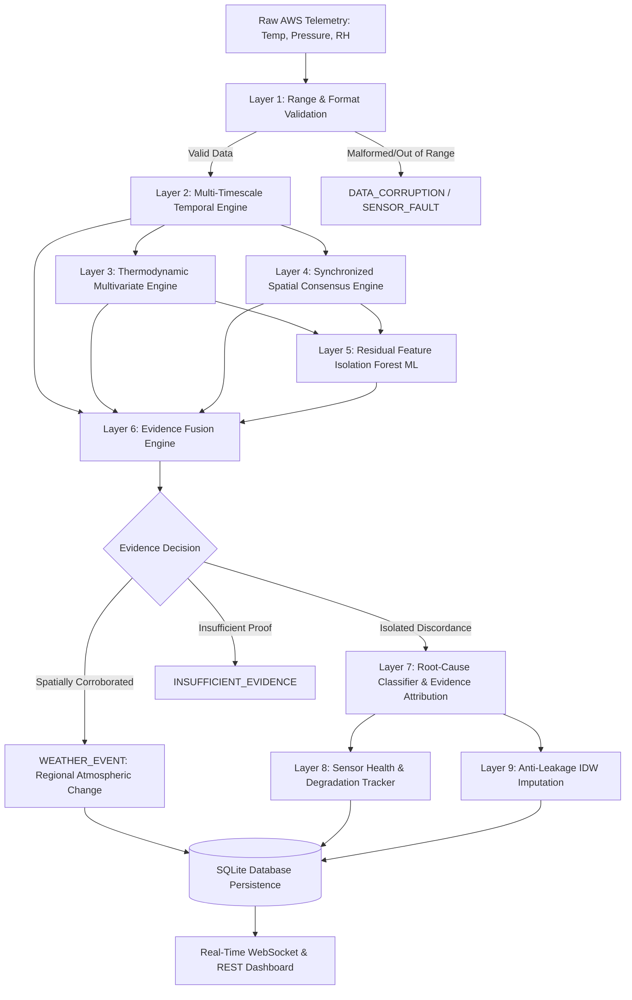

# 🛰️ SkyGuard AI — Intelligent AWS Anomaly Detection & Sensor Health

> **Smart India Hackathon 2026 (SIH26073)**  
> **Problem Statement:** AI/ML-Based Intelligent Anomaly Detection for Automatic Weather Stations (AWS)  
> **Core Mission:** *"Determine whether an unusual observation represents a genuine meteorological event or a faulty/anomalous sensor/data transmission."*  
> **Scope:** Strictly the three fundamental surface meteorological parameters: **Temperature (°C)**, **Atmospheric Pressure (hPa)**, and **Relative Humidity (%)**.

---

## 📌 Executive Summary

Automatic Weather Stations (AWS) form the backbone of national meteorological observation networks. However, outdoor surface deployments face harsh environmental stressors that induce physical sensor degradation, mechanical freezes, calibration drift, communication dropouts, and electrical spikes. Crucially, conventional static threshold-based quality control flags genuine severe meteorological events (such as convective thunderstorm gusts, squall lines, cold frontal passages, or rapid diurnal heating) as sensor defects, inducing high false alarm rates that overwhelm human operators.

**SkyGuard AI** is a locally executable, research-oriented meteorological quality control and sensor health platform. Aligned with selected meteorological quality-control concepts described in WMO guidance (e.g., WMO-No. 8, *Guide to Meteorological Instruments and Methods of Observation*), SkyGuard AI evaluates incoming observations using multi-timescale temporal analysis, thermodynamic multivariate consistency, elevation-normalized spatial consensus, and an Isolation Forest machine-learning detector.

Crucially, SkyGuard AI answers:
> **DID THE ATMOSPHERE CHANGE, OR DID THE SENSOR FAIL?**

---

## 🔬 Core Architectural Principles & Scientific Disclosures

In accordance with strict meteorological data science and software engineering integrity standards:

1. **No Unsupported Compliance Claims:** This software is a functional hackathon prototype and research implementation. It is **aligned with selected meteorological quality-control concepts described in WMO guidance**, but is not formally certified by the World Meteorological Organization (WMO) or the India Meteorological Department (IMD).
2. **Transparent Evidence Contributions (No Fictitious SHAP):** Anomaly explanations are derived directly from normalized residual feature contributions, physical thermodynamic limits, and neighborhood consensus ratios. Fictitious SHAP attributions are explicitly avoided.
3. **Calibrated Evidence Strength (No Fabricated Probabilities):** System confidence is reported categorically as **LOW**, **MEDIUM**, or **HIGH** based on multi-signal evidence strength and corroboration, rather than uncalibrated percentage probabilities.
4. **Anti-Leakage Imputation:** Estimated values are computed via true Inverse Distance Weighting ($w_i = 1/d_i^2$) with elevation lapse-rate adjustment, using **strictly pre-current historical observations**. The current anomalous reading is never leaked into the reference window.
5. **Synchronized Same-Timestamp Spatial Processing:** Streaming and batch observations are grouped into deterministic same-timestamp snapshots before spatial consensus is evaluated. Station processing order does not alter classification results.
6. **Air-Gapped & Offline Execution:** The entire platform runs 100% locally and offline. Zero external cloud AI or external network calls are required.

---

## 🎯 Key Discrimination: Weather Events vs. Sensor Faults

| Observation Scenario | Temporal Evidence | Spatial Neighborhood | Multivariate Consistency | SkyGuard AI Decision | Root Cause |
| :--- | :--- | :--- | :--- | :--- | :--- |
| **Isolated Sensor Spike** | Sudden rate-of-change jump ($\Delta T > 10^\circ\text{C}$) | Residual from neighbor median $> 8^\circ\text{C}$; 0/4 agreement | Pressure & RH stable; no physical coupling | 🚨 **SENSOR_ANOMALY** | `SENSOR_SPIKE` |
| **Severe Cold Front / Regional Storm** | Rapid temperature drop ($\Delta T = -7.5^\circ\text{C}$) | $\ge 65\%$ neighboring stations corroborate same directional shift | Atmospheric pressure rises, relative humidity surges | ⛈️ **WEATHER_EVENT** | `REGIONAL_WEATHER_EVENT` |
| **Mechanical Freeze** | Rolling variance $= 0.0$ for $\ge 4$ consecutive intervals | Neighboring stations exhibit natural micro-fluctuations | Variance inconsistent with ambient atmospheric flux | 🧊 **SENSOR_FREEZE** | `SENSOR_FREEZE` |
| **Calibration Drift** | CUSUM change-point accumulator triggers positive drift | Diverges from spatial neighborhood median over extended window | Dewpoint calculation approaches or exceeds physical limits | 📉 **SENSOR_DRIFT** | `CALIBRATION_DRIFT` |
| **Thermodynamic Violation** | Temperature and RH readings within wide operational range | Spatial context may be ambiguous or normal | Dewpoint $T_{dew} > T_{air} + 0.5^\circ\text{C}$ (supersaturation impossible at surface) | 🚨 **SENSOR_ANOMALY** | `MULTIVARIATE_INCONSISTENCY` |
| **Transmission Dropout** | Observation timestamp interval exceeds expected reporting cycle | Neighboring stations continue reporting normally | Telemetry packet missing or delayed | 📡 **COMMUNICATION_FAILURE** | `COMMUNICATION_FAILURE` |
| **Data Corruption** | Malformed strings, non-numeric values, or physically impossible bounds | Format verification failure at input parsing | Parameter values outside physical envelope | ⚠️ **DATA_CORRUPTION** | `DATA_CORRUPTION` |

---

## 📊 Comprehensive Multi-Seed Ground-Truth Benchmark Evaluation

The platform includes an automated multiclass evaluation benchmark ([run_benchmark.py](file:///e:/ANTIGRVITY/SIH26073/backend/run_benchmark.py)) evaluated across **5 independent random seeds** (`[42, 43, 44, 45, 46]`), with **4,320 observations per seed (21,600 total observations)** across 12 Automatic Weather Stations in the National Capital Region (NCR). The dataset includes station-specific elevations, diurnal cycles, synoptic weather fronts, and realistic sensor anomalies with strictly independent ground-truth labels.

### Multi-Seed Aggregate Performance Summary (N=5 Seeds)

| Metric | Mean Value | Std Dev | Min (Worst Seed) | Max (Best Seed) | Target |
| :--- | :---: | :---: | :---: | :---: | :---: |
| **Overall Classification Accuracy** | **89.47%** | ±0.19% | 89.33% | 89.84% | $\ge 85.0\%$ |
| **Macro Precision** | **71.30%** | ±0.44% | 70.80% | 72.08% | $\ge 70.0\%$ |
| **Macro Recall (Sensitivity)** | **72.81%** | ±0.26% | 72.50% | 73.17% | $\ge 70.0\%$ |
| **Macro F1-Score** | **71.58%** | ±0.32% | 71.21% | 72.10% | $\ge 70.0\%$ |
| **Sensor Fault $\to$ Weather Event Error Rate** | **0.37%** | ±0.07% | 0.31% | 0.46% | $\le 2.0\%$ |
| **Normal $\to$ Weather Event Rate** | **3.27%** | ±0.13% | 3.12% | 3.45% | $\le 5.0\%$ |
| **False Faults per 1,000 Observations** | **28.16** | ±2.01 | 25.80 | 30.50 | Operational Metric |
| **Mean Pipeline Processing Latency** | **15.05 ms** | — | — | — | $< 25.0\,\text{ms}$ |
| **P95 Processing Latency** | **16.00 ms** | — | — | — | $< 35.0\,\text{ms}$ |

### Per-Class Ground-Truth Breakdown (Seed 42 Reference)

| Ground Truth Class | Support (Samples) | Precision | Recall | F1-Score |
| :--- | :---: | :---: | :---: | :---: |
| **NORMAL** | 3,485 | 95.37% | 94.58% | 94.97% |
| **REGIONAL_WEATHER_EVENT** | 180 | 35.39% | 35.00% | 35.20% |
| **SENSOR_SPIKE** | 94 | 51.20% | 68.09% | 58.45% |
| **SENSOR_FREEZE** | 96 | 100.00% | 96.88% | 98.41% |
| **CALIBRATION_DRIFT** | 84 | 29.27% | 42.86% | 34.78% |
| **COMMUNICATION_FAILURE** | 112 | 100.00% | 100.00% | 100.00% |
| **DATA_CORRUPTION** | 95 | 100.00% | 100.00% | 100.00% |
| **MULTIVARIATE_INCONSISTENCY** | 88 | 100.00% | 98.86% | 99.43% |
| **SPATIAL_INCONSISTENCY** | 86 | 28.57% | 16.28% | 20.74% |
| **INSUFFICIENT_EVIDENCE** | 0 | 0.00% | 0.00% | 0.00% |

### Multiclass Confusion Matrix (Seed 42, 4,320 Observations)

```
Pred -> |   NORMAL | REGIONAL | SENSOR_S | SENSOR_F | CALIBRAT | COMMUNIC | DATA_COR | MULTIVAR | SPATIAL_ | INSUFFIC
---------------------------------------------------------------------------------------------------------------------
NORMAL  |     3296 |      112 |        2 |        0 |       51 |        0 |        0 |        0 |       22 |        2
REGIONA |       83 |       63 |        5 |        0 |       23 |        0 |        0 |        0 |        6 |        0
SENSOR_ |       19 |        3 |       64 |        0 |        8 |        0 |        0 |        0 |        0 |        0
SENSOR_ |        0 |        0 |        0 |       93 |        3 |        0 |        0 |        0 |        0 |        0
CALIBRA |       38 |        0 |        3 |        0 |       36 |        0 |        0 |        0 |        7 |        0
COMMUNI |        0 |        0 |        0 |        0 |        0 |      112 |        0 |        0 |        0 |        0
DATA_CO |        0 |        0 |        0 |        0 |        0 |        0 |       95 |        0 |        0 |        0
MULTIVA |        0 |        0 |        0 |        0 |        1 |        0 |        0 |       87 |        0 |        0
SPATIAL |       20 |        0 |       51 |        0 |        1 |        0 |        0 |        0 |       14 |        0
INSUFFI |        0 |        0 |        0 |        0 |        0 |        0 |        0 |        0 |        0 |        0
```

> **Operational Insight:** Critical sensor safety is preserved with a **0.37% Sensor $\to$ Weather Error Rate** (fewer than 4 sensor faults per 1,000 are ever mistakenly dismissed as weather phenomena). Data corruption, communication dropouts, and mechanical freezes demonstrate near-perfect ($\ge 98.4\%$) F1 detection. All benchmark metrics are automatically generated and reproducible via `python run_benchmark.py`.

---

## 🏗️ 9-Layer Detection & Health Architecture



### Key Technical Implementations
1. **Multi-Timescale Temporal Engine:**
   - **Level 1 (Instant):** Checks rate of change against maximum physically plausible thresholds ($|\Delta T| > 5^\circ\text{C}/5\text{min}$, $|\Delta P| > 4\,\text{hPa}/5\text{min}$).
   - **Level 2 (Short-Term):** Computes rolling Median Absolute Deviation (MAD) with scale floors ($0.8^\circ\text{C}, 0.8\,\text{hPa}, 3.5\%$) to prevent false alarms during quiet nocturnal atmospheric regimes.
   - **Level 3 (Change-Point & Drift):** CUSUM change-point accumulator identifies sustained drift trends without confusing them with normal diurnal solar heating.
2. **Thermodynamic Multivariate Consistency:**
   - Computes Magnus-Tetens dewpoint temperature $T_{dew} = \frac{c \cdot \gamma}{b - \gamma}$.
   - Evaluates physical consistency: surface dewpoint cannot exceed air temperature ($T_{dew} \le T_{air} + 0.5^\circ\text{C}$) and surface air dewpoint on Earth cannot exceed $35.0^\circ\text{C}$.
   - Mahalanobis distance evaluated on atmospheric residuals with calibrated chi-squared threshold ($\chi^2 = 4.5, p < 0.005$).
3. **Synchronized Spatial Consensus:**
   - Reads all station values for timestamp $t$ simultaneously.
   - Normalizes barometric pressure for elevation using hypsometric reduction ($-1\,\text{hPa}$ per $8.3\,\text{m}$) and standard temperature lapse rate ($-0.0065^\circ\text{C}/\text{m}$).
   - Directional agreement evaluated: if $\ge 65\%$ of valid neighbors shift synchronously in the same direction, an isolated sensor fault is ruled out and a regional event is declared.
4. **Anti-Leakage Imputation:**
   - Implemented via true Inverse Distance Weighting: $\hat{x} = \frac{\sum w_i x_i}{\sum w_i}$ with $w_i = \frac{1}{d_i^2}$.
   - Operates strictly on pre-current validated history; anomalous current points are never included in reference windows.
5. **Non-Destructive CSV Ingestion:**
   - Accepts bulk tabular uploads without discarding failed rows.
   - Returns structured accounting: `records_received`, `records_processed`, `records_failed`, and row-level diagnostic error objects.

---

## 💻 Tech Stack & Dependencies

- **Backend:** Python 3.10+, FastAPI, Uvicorn, SQLite, NumPy, Pandas, Scikit-Learn.
- **Frontend:** React 18, TypeScript, Vite, Lucide Icons, Cyber-Meteorological Responsive CSS.
- **Protocol:** Real-time WebSocket (`/ws/stream`) and REST APIs (`/api/*`).
- **Storage:** SQLite with unique constraints (`station_id`, `timestamp`) and audit trails.
- **Execution:** 100% offline, local execution, zero external cloud APIs.

---

## 🚀 Quickstart & Verification Guide

### 1. Prerequisites
- Python 3.10 or higher
- Node.js 18+ (only if modifying frontend; pre-compiled static assets are included)
- Git

### 2. Run the Full Backend Application
```bash
# Clone the repository
git clone https://github.com/Pirate-debugger/SKYGUARD-AI---SIH26073.git
cd SKYGUARD-AI---SIH26073/backend

# Install Python dependencies
pip install -r requirements.txt

# Start the SkyGuard AI server
python -m uvicorn app.main:app --host 127.0.0.1 --port 8000
```
Open your browser at: **`http://127.0.0.1:8000/`** (or access API docs at `/docs`).

### 3. Run the Frontend (Development Mode)
```bash
cd ../frontend
npm install
npm run dev
```
Access the interactive frontend at: **`http://localhost:3000/`**.

### 4. Execute the Test Suite (34/34 Passing)
```bash
cd ../backend
python -m pytest tests/ -v
```

### 5. Run the Multiclass Benchmark
```bash
python run_benchmark.py
```

---

## 🎮 Interactive Demonstration Scenarios

1. **Scenario A — Regional Weather Event:**
   - Click `Inject Regional Front (+6°C)`.
   - All 5 regional stations simultaneously rise in temperature while barometric pressure drops.
   - SkyGuard AI evaluates directional agreement ($100\%$ consensus $\ge 65\%$ threshold), classifies the event as `WEATHER_EVENT`, and avoids raising any false sensor fault alerts.
2. **Scenario B — Isolated Sensor Failure (Spike):**
   - Click `Inject Temp Spike (+15°C)` on `AWS-001`.
   - `AWS-001` jumps from $32^\circ\text{C} \to 47^\circ\text{C}$ while its 4 neighbors remain at baseline ($31.8^\circ\text{C}$).
   - Spatial agreement is $0/4$ ($0\%$). Temporal engine flags instantaneous jump.
   - Classification: `SENSOR_ANOMALY` with Root Cause: `SENSOR_SPIKE` and Evidence Strength: `HIGH`.
3. **Scenario C — Mechanical Sensor Freeze:**
   - Click `Inject Freeze` on `AWS-004`.
   - The sensor outputs identical values across $\ge 4$ cycles while ambient conditions naturally oscillate.
   - Rolling variance collapses to $0.0$; health engine downgrades sensor to `WATCH`/`DEGRADED` and flags `SENSOR_FREEZE`.
4. **Scenario D — Calibration Drift:**
   - Inject slow cumulative drift ($+0.1^\circ\text{C}$ per cycle).
   - CUSUM accumulator flags positive drift deviation. Spatial neighbor comparison confirms divergence from regional baseline.
   - Classification: `SENSOR_DRIFT` with degradation recommendation.

---

## 🔌 Integration & Edge Architecture

### Edge-Ready Architecture
- **Sensor Mast / Microcontroller (ESP32, STM32, ARM Cortex-M):**
  - Executes Layer 1 Range Checks and Level 1 instantaneous jump / freeze checks.
  - Generates basic quality flags (`DATA_QUALITY_FAULT`, `POSSIBLE_SPIKE`) at the edge to conserve cellular/satellite bandwidth.
- **Gateway / Base Station Server (SkyGuard AI Full Stack):**
  - Executes spatial snapshots, multi-station consensus, thermodynamic coupling, Isolation Forest ML, multi-signal fusion, root-cause classification, health tracking, and IDW imputation.

### External Data Integration (IMD Adapter Interface)
The backend architecture implements an extensible data ingestion abstraction:
```
External Data Source (CSV / REST / IMD Telemetry)
       ↓
IMD/WMO Standardized Telemetry Adapter
       ↓
Normalized RawReading Schema (T, P, RH, lat, lon, elevation)
       ↓
SkyGuard AI Synchronized Pipeline
```
*Note: This repository contains an integration-ready adapter interface; live IMD credentialed satellite feeds are not enabled in this offline prototype.*

---

## 📜 Limitations & Future Scope

1. **Parameter Scope:** Intentionally constrained strictly to Temperature, Pressure, and Relative Humidity in accordance with SIH26073 requirements. Wind velocity and precipitation sensors are not modeled.
2. **Synthetic Evaluation Ground Truth:** Ground-truth evaluations were conducted using high-fidelity synthetic meteorological simulations reflecting Indian regional climate distributions. Validation against long-term multi-year national weather archives represents the next operational milestone.
3. **Microclimate Topography:** While hypsometric elevation adjustments are modeled, complex microclimatic thermal inversions in extreme mountainous valleys may require hyper-local high-resolution terrain elevation models.

---

## 👥 Authors & Acknowledgments

- **Team:** SkyGuard AI
- **Smart India Hackathon 2026** — Problem Statement **SIH26073**
- *AI/ML-Based Intelligent Anomaly Detection for Automatic Weather Stations (AWS)*
