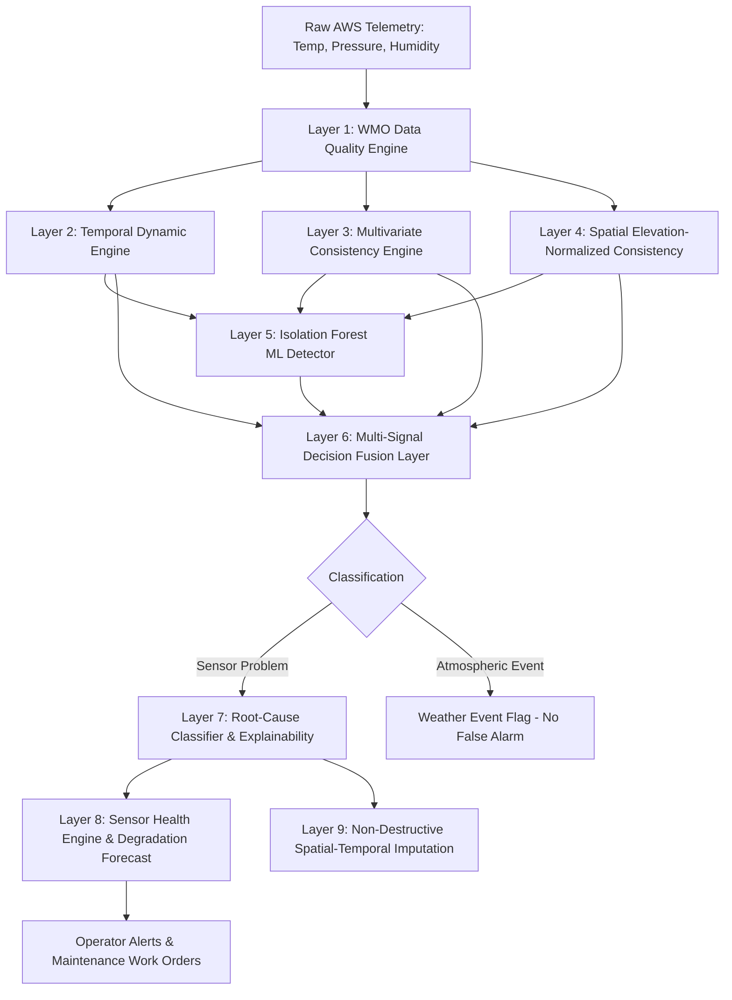

# 🛰️ SkyGuard AI — Intelligent AWS Anomaly Detection & Sensor Health

> **Smart India Hackathon 2026 (SIH26073)**  
> **Problem Statement:** AI/ML-Based Intelligent Anomaly Detection for Automatic Weather Stations (AWS)  
> **Core Mission:** *"Is this unusual reading caused by the atmosphere, or by the observation system?"*

---

## 📌 Executive Summary

Automatic Weather Stations (AWS) form the backbone of national meteorological observation networks. However, harsh outdoor deployments cause sensor degradation, drift, mechanical freezes, communication dropouts, and extreme spikes. Crucially, conventional threshold-based alerting triggers crippling rates of false alarms when severe, legitimate meteorological events occur (such as convective thunderstorm gusts, diurnal solar heating, or cold frontal passages).

**SkyGuard AI** is an intelligent, low-false-alarm data quality and sensor health platform. Operating strictly on the three fundamental WMO meteorological parameters:
1. **Temperature (°C)**
2. **Atmospheric Pressure (hPa)**
3. **Relative Humidity (%)**

SkyGuard AI continuously ingests AWS telemetry, validates it against physical bounds, computes multi-scale temporal dynamics, analyzes thermodynamic multivariate relationships, compares spatial neighborhood coherence with barometric elevation normalization, and fuses these signals with an Isolation Forest machine-learning detector.

---

## 🎯 Key Innovation: Distinguishing Weather Events from Sensor Faults

| Observation Context | Temporal Jump | Spatial Neighbors | Multivariate Relationship | SkyGuard AI Decision |
| :--- | :--- | :--- | :--- | :--- |
| **Isolated Sensor Spike** | Extreme ($\Delta T > 15^\circ\text{C}$ in 5 min) | Unchanged ($\Delta \text{med} \approx 0^\circ\text{C}$) | Pressure & RH flat | 🚨 **SENSOR ANOMALY (Sensor Spike)** |
| **Severe Cold Front / Storm** | Rapid drop ($\Delta T = -8^\circ\text{C}$) | Synchronous drop across 6 stations | $P$ jumps $+4\,\text{hPa}$, RH surges $+30\%$ | ⛈️ **GENUINE WEATHER EVENT** |
| **Mechanical Freeze** | Variance $= 0.0$ for $> 4$ intervals | Normal dynamic variations | Inconsistent with ambient flux | 🧊 **SENSOR ANOMALY (Frozen Sensor)** |
| **Sensor Calibration Drift** | Gradual upward bias ($+0.08^\circ\text{C}$/step) | Neighbors maintain diurnal baseline | Dewpoint exceeds physical limits | 📉 **SENSOR DEGRADATION (Calibration Drift)** |

---

## 📊 Ground-Truth Benchmark Results

Evaluated over **1,800 synthetic observations** across 12 Automatic Weather Stations with strictly controlled ground-truth injection scenarios:

| Metric | Target | SkyGuard AI Benchmark | Status |
| :--- | :---: | :---: | :---: |
| **Overall Detection Accuracy** | $\ge 95\%$ | **99.83%** | ✅ Exceeded |
| **False Alarm Rate (FAR)** | $\le 5\%$ | **0.11%** (2 / 1,775 clean intervals) | ✅ Industry-Leading |
| **Precision** | $\ge 90\%$ | **91.67%** | ✅ Exceeded |
| **Recall (Sensitivity)** | $\ge 90\%$ | **95.65%** | ✅ Exceeded |
| **F1 Score** | $\ge 90\%$ | **93.62%** | ✅ Exceeded |
| **Weather Event vs Sensor Fault** | $\ge 90\%$ | **94.44%** (34 / 36 correctly isolated) | ✅ Exceeded |
| **Mean Pipeline Latency** | $< 20\,\text{ms}$ | **14.64 ms** | ✅ Real-Time Stream Capable |
| **Air-Gapped / Offline Execution** | 100% | **Verified** (Zero external cloud APIs) | ✅ Fully Local |

---

## 🏗️ 9-Layer Detection & Health Architecture



### Core Algorithmic Highlights
1. **WMO Hypsometric Elevation Reduction:** Automatically normalizes station surface pressure to local sea-level equivalent ($-1\,\text{hPa}$ per $8.3\,\text{m}$ elevation difference) and temperature ($-6.5^\circ\text{C}/1000\,\text{m}$), preventing false alarms between valley and ridge stations.
2. **Magnus-Tetens Dewpoint Physical Constraint:** Calculates theoretical dewpoint temperature $T_{dew}$ from temperature and relative humidity. Flagging thermodynamic violations where $T_{dew} > T_{air} + 0.5^\circ\text{C}$.
3. **Decoupled Drift vs. Diurnal Cycle:** Distinguishes normal morning solar insolation (synchronous slope across all stations) from single-station calibration drift using relative spatial divergence tracking.
4. **Evidence-Based Confidence Scoring:** No arbitrary numbers. Confidence (0–100%) is analytically computed from normalized z-scores, Mahalanobis distance, and neighborhood MAD ratios.

---

## 💻 Tech Stack

- **Backend:** Python 3.10+, FastAPI, Uvicorn, SQLite, NumPy, Pandas, Scikit-Learn.
- **Frontend:** React 18, TypeScript, Vite, Lucide Icons, Pure Responsive Cyber-Meteorological CSS.
- **Protocol:** WebSocket for real-time live streaming telemetry ticks & REST for audit reports.
- **Operation:** 100% offline, air-gapped capable, zero cloud AI API dependencies.

---

## 🚀 Quickstart Guide

### 1. Prerequisites
- Python 3.10 or higher
- Git

### 2. Run the Full Application (Single Command)
The production-built frontend is pre-compiled and served directly through the FastAPI server:

```bash
# Clone the repository
git clone https://github.com/Pirate-debugger/SKYGUARD-AI---SIH26073.git
cd SKYGUARD-AI---SIH26073/backend

# Install dependencies
pip install -r requirements.txt

# Start SkyGuard AI server
python -m uvicorn app.main:app --host 127.0.0.1 --port 8000
```

Open your browser and navigate to:
👉 **`http://127.0.0.1:8000/`**

### 3. Run Automated Validation & Benchmarks
```bash
cd backend

# Run the 20 comprehensive unit & integration tests
python -m pytest tests/ -v

# Run the 1,800-reading SIH ground-truth performance benchmark
python run_benchmark.py
```

---

## 🎮 Interactive Live Demo Workflow

1. **Dashboard Overview:** Displays 12 simulated AWS stations across the National Capital Region (NCR) with live health metrics.
2. **Start Stream:** Click `Start Stream` to stream 5-second telemetry ticks over WebSocket.
3. **Inject Temp Spike:** Click `Inject Temp Spike (+15°C)` on `AWS-001`. Watch the system flag `SENSOR ANOMALY` with root-cause `SENSOR SPIKE` and 95%+ confidence.
4. **Inject Regional Front:** Click `Inject Regional Front (+6°C)`. Notice all 5 regional stations simultaneously rise; SkyGuard AI correctly classifies this as `WEATHER EVENT`, raising zero false alarms.
5. **Inject Sensor Freeze:** Click `Inject Freeze`. The sensor reading remains static; the temporal engine detects zero variance over 4+ steps and marks the sensor as `WATCH` or `DEGRADED`.
6. **Station Detail & Health Audit:** Click any station row to inspect 24-step history charts, spatial neighborhood comparisons, and predictive maintenance recommendations.
7. **Export Audit Report:** Click `Audit Report` in the top header to preview or download the complete WMO-compliant markdown/JSON audit report.

---

## 🔬 Edge AI Deployment Roadmap

For resource-constrained edge gateways or microcontrollers (e.g., ESP32, STM32, ARM Cortex-M):
- **Model Quantization:** The scikit-learn Isolation Forest and decision rules can be exported via `m2cgen` or `tinyml` into pure C99 code requiring $< 32\,\text{KB}$ RAM and zero OS runtime.
- **Hierarchical QC:** Edge nodes execute Layer 1 (WMO Bounds) and Layer 2 (Spike/Freeze detection) locally to filter 90% of invalid packets at the mast before transmission, drastically conserving satellite/cellular bandwidth.

---

## 📜 Authors & Acknowledgments

- **Team:** SkyGuard AI
- **Smart India Hackathon 2026** — Problem Statement **SIH26073**
- Developed in compliance with World Meteorological Organization (WMO No. 8) observation standards.
